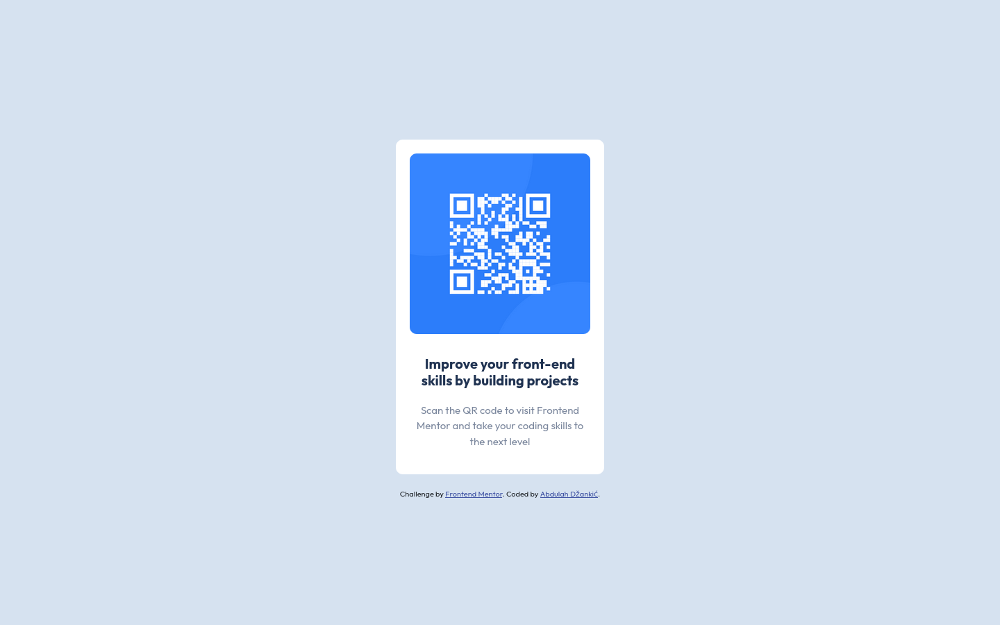

# Frontend Mentor - QR code component solution

This is a solution to the [QR code component challenge on Frontend Mentor](https://www.frontendmentor.io/challenges/qr-code-component-iux_sIO_H). Frontend Mentor challenges help you improve your coding skills by building realistic projects.

### Screenshot

### Links

- Live Site URL: [https://adzaa.github.io/QR_Code/](https://adzaa.github.io/QR_Code/)

## My process

### Built with

- Semantic HTML5 markup
- CSS custom properties
- Flexbox

## Author

- Website - [Abdulah Džankić](abdulah-dzankic.netlify.app/)
- Frontend Mentor - [@adzaa](https://www.frontendmentor.io/profile/adzaa)
